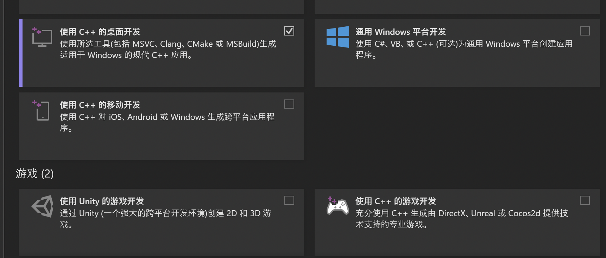

# 关于模型部署

[English Version](README_en.md)

### 先决条件：

#### 对于Windows环境：

1. 需要已安装``python``，我自己的环境为``python=3.9.12``，更低版本不能保证可以部署成功。
2. 需要先安装``C++ 14 Build Tool``，具体流程为:

* 打开API目录下的``VisualStudioSetup.exe``，在工作负载中选择使用C++的桌面开发，等待其安装完毕即可。

3. 执行目录下的``building_environment.bat``，将自动完成安装并添加系统变量。

#### 对于Linux环境：
需要tensorflow>=2.5，不满足先运行：

```bash
pip install -U "tensorflow>=2.5"
```

再执行以下命令

```bash
sudo apt install -y protobuf-compiler
cd <API所在目录>/models/research/
protoc object_detection/protos/*.proto --python_out=.
python -m pip install .
```

# 关于API使用

1. 本项目识别部分基于百度的AIStudio，需要先取得自己的

   ```python
   APP_ID
   API_KEY
   SECRET_KEY
   ```

   按照以上顺序将密钥存放在根目录的``keys.json``中，程序将自动识别文件中的换行符进行读取。

2. 将已有的人脸图片以需要的识别结果命名，存放至``faces_database``文件夹下；将需要识别的图片存放至``faces_to_process``文件夹下。

3. 执行``run.bat``，执行成功后能在``results``文件夹下找到输入图片的识别结果。